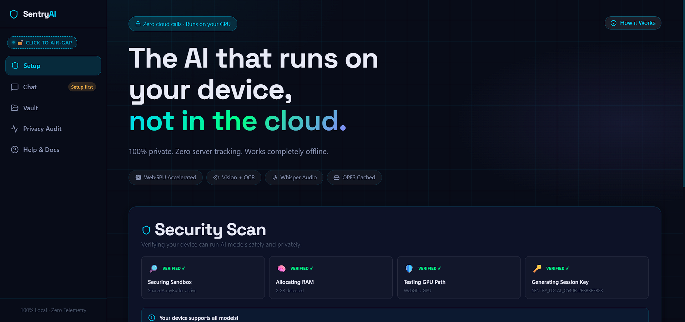
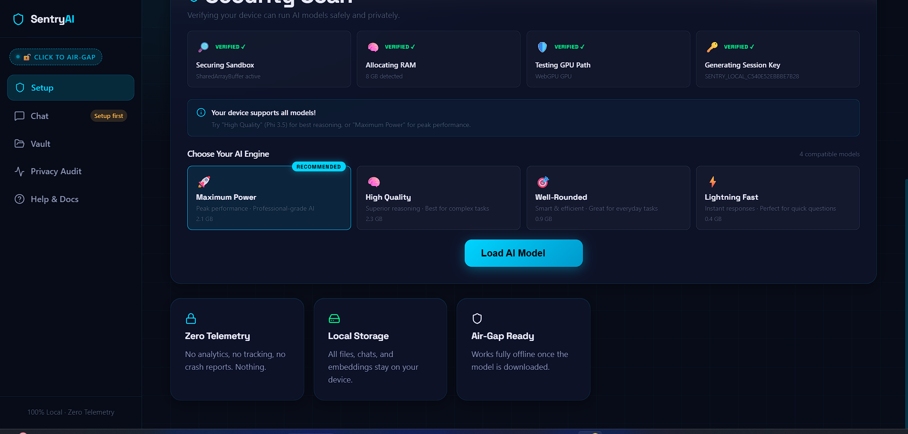
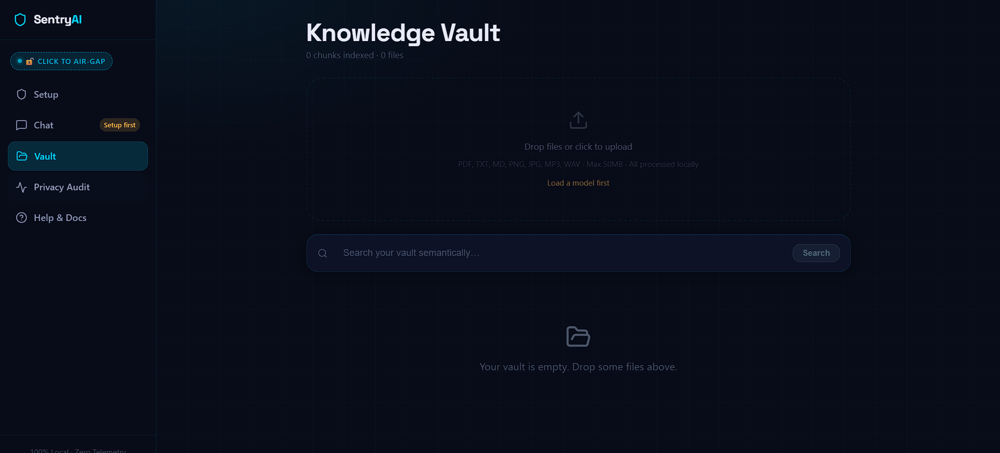
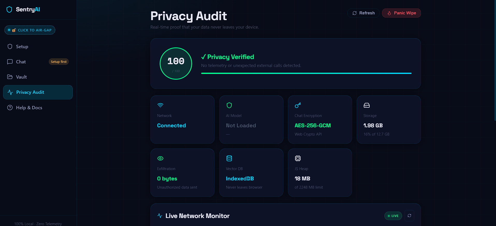
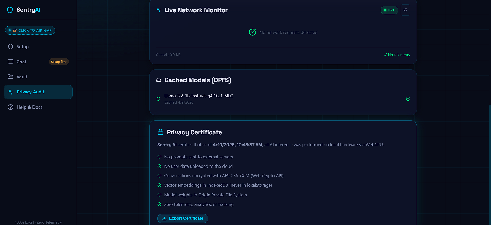
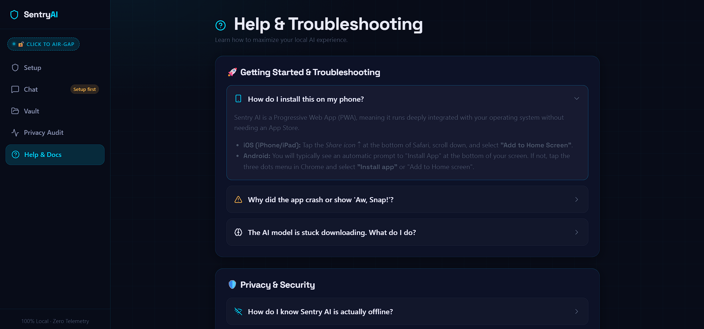

# 🛡️ Sentry AI — Private Intelligence, Runs 100% In Your Browser

<div align="center">


**The AI assistant that never phones home.**
Runs LLaMA 3.2 / Phi 3.5 / Qwen 2.5 entirely in your browser via WebGPU.
Your prompts, documents, and conversations never leave your device — ever.

[🚀 **Live Demo**](https://sentry-ai-one.vercel.app) · [📖 How It Works](#how-it-works) · [⚡ Quick Start](#quick-start)

</div>

---

## 📸 Screenshots

### Home — Hero & Security Scan
> "The AI that runs on your device, not in the cloud." — Automatically scans your hardware on load.



---

### Setup — Hardware-Adaptive Model Picker
> Detects GPU, RAM, SharedArrayBuffer. All 4 checks VERIFIED ✓. Recommends best model for your device. 8 GB RAM detected here → all 4 models unlocked.



---

### Knowledge Vault — Private RAG
> Upload PDFs, text, images, audio. Everything processed locally. Semantic search via local MiniLM embeddings stored in IndexedDB. Zero external calls.



---

### Privacy Audit — Live Proof of Zero Exfiltration
> **Privacy score: 100/100.** Live network monitor showing 0 requests. AES-256-GCM encryption active. Exfiltration: **0 bytes**.



---

### Privacy Certificate — Exportable Audit Trail
> LLaMA 3.2 1B cached in OPFS since 4/9/2026. Downloadable certificate with timestamp proving all inference ran on local hardware via WebGPU.



---

### Help & Troubleshooting
> Built-in FAQ: PWA installation, crash recovery, offline usage, storage management.



---

## ✨ What Makes This Different

Most AI tools send your data to servers. Sentry AI doesn't — because there are no servers involved in inference. The model runs directly on your GPU through the browser's WebGPU API.

| | Cloud AI (ChatGPT etc.) | **Sentry AI** |
|---|---|---|
| Prompts sent to servers | ✅ Always | ❌ Never |
| Works fully offline | ❌ No | ✅ Yes |
| Data stored in cloud | ✅ Yes | ❌ Local only |
| Requires account / login | ✅ Yes | ❌ No |
| Privacy score | ❓ Unknown | ✅ **100 / 100** (verified live) |
| Runs on your GPU | ❌ No | ✅ WebGPU |

---

## 🎯 Core Features

### 🧠 Local AI Inference
- Runs **LLaMA 3.2 (1B & 3B)**, **Phi 3.5 Mini (3.8B)**, **Qwen 2.5 (0.5B)** — all locally
- **WebGPU acceleration** for GPU-supported browsers (Chrome, Edge, Brave)
- **WebAssembly fallback** via Transformers.js + ONNX Runtime for iOS Safari, Firefox, older Android
- Hardware detection at startup — automatically selects the right model tier
- Models cached in **Origin Private File System (OPFS)** — instant loads after first download

### 🔒 Privacy Architecture
- **Privacy score: 100/100** — verified live via PerformanceObserver network monitoring
- **Zero telemetry** — no analytics, no crash reporting, no tracking of any kind
- **Service Worker kill-switch** — blocks ALL non-local network requests in Air-Gap mode
- **AES-256-GCM encryption** for all stored conversations via Web Crypto API
- **Exportable Privacy Certificate** with timestamp and full audit trail
- **Threat detection** — regex-based prompt injection & jailbreak scanner on every message
- **Clipboard guard** — strips RTL override attacks, zero-width chars, homograph attacks on paste

### 📚 Private RAG (Retrieval-Augmented Generation)
- Upload PDFs, text, images, or audio — all processed 100% locally
- **Orama vector database** stored in IndexedDB — never leaves the browser
- **Hybrid search** (vector + full-text) using local MiniLM embeddings
- PDF parsing via pdfjs-dist, OCR via Tesseract.js, audio transcription via Whisper — all local
- Vault documents automatically injected as context into relevant conversations

### 🔍 Privacy Audit Dashboard
- Real-time PerformanceObserver monitoring of every network request
- Distinguishes: local assets / expected model downloads / CDN assets / telemetry (blocked) / unexpected calls
- **Panic Wipe button** — instantly destroys all conversations, encryption keys, and vault data
- Generates downloadable **Privacy Certificate** with full timestamp

---

## 🏗️ How It Works

```
┌─────────────────────────────────────────────────────┐
│                    Browser Tab                       │
│                                                      │
│  React UI  ──Comlink──►  AI Worker (Web Worker)     │
│     │                        │                       │
│     │                   ┌────┴────┐                  │
│     │                   │  WebGPU │  ← LLaMA/Phi/   │
│     │                   │   MLC   │    Qwen models   │
│     │                   └────┬────┘                  │
│     │                   ┌────┴────┐                  │
│     │                   │  WASM   │  ← Fallback      │
│     │                   │  ONNX   │  (iOS / older)   │
│     │                   └─────────┘                  │
│     │                                                │
│  Orama DB ◄── MiniLM Embeddings ◄── Uploaded Docs  │
│  (IndexedDB)      (local)           (PDF/TXT/IMG)   │
│                                                      │
│  Service Worker ── blocks all telemetry domains     │
│  OPFS ──────────── caches model weights (1–2 GB)    │
│  Web Crypto ─────── AES-256-GCM chat encryption     │
└─────────────────────────────────────────────────────┘
                          │
                  ZERO external calls
                   during inference
```

### Key Technical Decisions

**Why Web Workers + Comlink?**
LLM inference blocks the main thread for seconds. Running it in a dedicated Web Worker via Comlink keeps the UI fully responsive during token streaming.

**Why OPFS for model storage?**
Origin Private File System gives browsers fast, quota-managed storage for large binary files. Model weights (0.4–2.3 GB) are stored here and survive browser restarts without re-downloading.

**Why Orama instead of a cloud vector DB?**
Orama runs entirely in-memory with IndexedDB persistence. No server, no API key, no data leaving the device. Supports hybrid vector + full-text search out of the box.

**Why the WebAssembly fallback matters?**
WebGPU is available on ~60% of devices (mostly desktop Chrome/Edge). The WASM path via Transformers.js + ONNX covers iOS Safari, Firefox, and older Android — the remaining 40%.

**The fake WebGPU problem:**
Some devices report WebGPU support but run SwiftShader (software renderer) underneath. Loading a 2 GB model on SwiftShader causes instant OOM crashes. Fix: check `adapter.limits.maxBufferSize` to distinguish real GPU from software emulation.

---

## ⚡ Quick Start

### Prerequisites
- Node.js 18+
- Chrome 113+ / Edge 113+ / Brave (for WebGPU path)
- 4 GB+ RAM recommended

```bash
# Clone the repo
git clone https://github.com/gagan13singh/sentry-ai.git
cd sentry-ai

# Install dependencies
npm install

# Start dev server
npm run dev
```

Open `http://localhost:5173` — the security scan runs automatically.

### First Run
1. Security Scan checks your GPU, RAM, and browser capabilities
2. Select a model — the recommended one is pre-selected based on your hardware
3. Click **Load AI Model** — downloads weights once (~0.4–2.3 GB, one-time only)
4. Go fully offline — everything works without internet after first load

### Production Build
```bash
npm run build
npm run preview
```

> **Important:** `vercel.json` sets the required COOP/COEP headers for SharedArrayBuffer. Without these, WebLLM silently falls back to WASM.

---

## 🛠️ Tech Stack

| Layer | Technology | Purpose |
|---|---|---|
| Frontend | React 19 + Vite 8 | UI + fast HMR |
| LLM Inference (GPU) | MLC AI WebLLM | WebGPU-accelerated LLM runtime |
| LLM Inference (CPU) | Transformers.js + ONNX | Universal fallback for all devices |
| Vector DB | Orama | In-browser hybrid search, no server |
| Embeddings | all-MiniLM-L6-v2 | Local semantic search embeddings |
| PDF Processing | pdfjs-dist | Client-side PDF text extraction |
| OCR | Tesseract.js | Local image text recognition |
| Speech-to-Text | Whisper tiny.en | Local audio transcription |
| Storage | OPFS + IndexedDB | Model weights + structured data |
| Encryption | Web Crypto API | AES-256-GCM conversation encryption |
| Worker Bridge | Comlink | Type-safe Web Worker communication |
| Markdown + Math | marked + KaTeX | Safe HTML + LaTeX math rendering |
| PWA | Vite PWA + Workbox | Installable, offline-capable app |
| Deployment | Vercel | Edge network + security headers |

---

## 📁 Project Structure

```
sentry-ai/
├── src/
│   ├── components/
│   │   ├── Diagnostic.jsx        # Hardware scan + model selection UI
│   │   └── ReactMarkdown.jsx     # Safe markdown with KaTeX math rendering
│   ├── hooks/
│   │   ├── useModelManager.js    # LLM lifecycle: detect → load → chat
│   │   ├── useSessionVault.js    # AES-256-GCM conversation encryption
│   │   ├── useNetworkAudit.js    # Real-time network request monitoring
│   │   ├── useThreatDetector.js  # Prompt injection + PII scanner
│   │   ├── useClipboardGuard.js  # Clipboard attack prevention
│   │   ├── useKnowledgeAugment.js # Knowledge cutoff detection
│   │   └── useConnectionStatus.js # Online / offline / air-gap state
│   ├── lib/
│   │   ├── deviceProfile.js      # Hardware detection + model tier selection
│   │   ├── orama.js              # Vector DB: ingest, search, persist
│   │   ├── opfs.js               # Origin Private File System model cache
│   │   └── promptTemplates.js    # Built-in prompt shortcuts
│   ├── pages/
│   │   ├── Home.jsx              # Onboarding + model loader
│   │   ├── Chat.jsx              # Main chat interface
│   │   ├── Vault.jsx             # Document upload + RAG management
│   │   ├── Audit.jsx             # Privacy dashboard (100/100)
│   │   └── Help.jsx              # FAQ + troubleshooting
│   ├── workers/
│   │   └── ai.worker.js          # Isolated AI inference (Web Worker)
│   └── sw.js                     # Service worker: caching + request blocking
├── docs/
│   └── screenshots/              # UI screenshots
├── vercel.json                   # COOP/COEP headers for SharedArrayBuffer
└── vite.config.js                # Build config + PWA + chunk splitting
```

---

## 🔐 Security Model

### Network Blocking
The Service Worker intercepts every outgoing request:
- **Always blocked:** Google Analytics, Mixpanel, Sentry.io, Hotjar, Amplitude, and 15+ other telemetry domains
- **Air-Gap mode:** blocks ALL non-localhost requests including model CDNs
- **All activity logged** in the Privacy Audit dashboard with risk classification

### Threat Detection Pipeline
Every message goes through two phases before hitting the LLM:
1. **Pattern scanner** (microseconds) — detects prompt injection, jailbreak attempts, Unicode tricks, PII
2. **AI scanner** (optional, when model is loaded) — LLM-based classification for ambiguous inputs

### Conversation Encryption
- Ephemeral passphrase generated per session, stored only in `sessionStorage`
- PBKDF2 (310,000 iterations, SHA-256) derives an AES-256-GCM key
- All conversations encrypted before `localStorage` write
- Keys never persisted — conversations unreadable after tab close

---

## 🚀 Deployment

Live at **[sentry-ai-one.vercel.app](https://sentry-ai-one.vercel.app)**

The `vercel.json` sets required security headers:
```json
{
  "Cross-Origin-Opener-Policy": "same-origin",
  "Cross-Origin-Embedder-Policy": "require-corp"
}
```
These are required for `SharedArrayBuffer` — which WebLLM needs for parallel model loading.

---

## 🗺️ Roadmap

- [ ] Multi-modal support (vision Q&A on uploaded images)
- [ ] Encrypted conversation export to file
- [ ] Custom system prompts per conversation
- [ ] Browser extension version (sidebar AI)
- [ ] WebGPU compute shader optimizations for faster token prefill

---

## 🤝 Contributing

PRs welcome. Please open an issue first for major changes.

```bash
npm run lint     # ESLint check
npm run build    # Production build — both must pass before PR
```

See [CONTRIBUTING.md](CONTRIBUTING.md) for architecture constraints.

---

## 📄 License

MIT — use it, fork it, build on it.

---

<div align="center">

Built by a CSE student who wanted an AI that doesn't spy on you.

**⭐ Star this repo if you find it useful — it helps more than you think.**

</div>